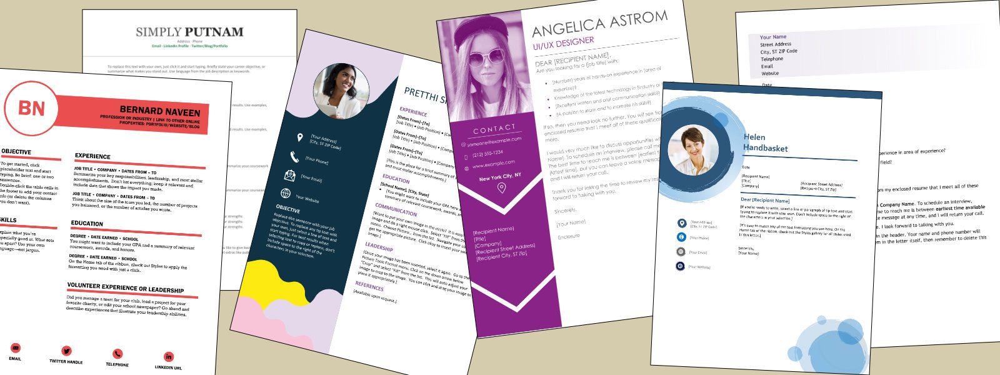

## Start From the Beginning
If you have the time to learn the best way to apply for jobs, we are presenting this in a step by step manner ideal for an applicant to show their best face and have the absolute best chance of landing the job. [Learn step by step how to Get That Job](/prepare-in-advance)

## OR Jump to What You Need Right Now
If you only have a day or two to apply to a job and need tips on submitting your resume itself, how to best write a cover letter or anything else we cover in this website, by all means just jump to the section you need. 

- [Start early - before you need a job](/prepare-in-advance)
- Learn about the process of looking for a job (not yet implemented)
- Finding the jobs (not yet implemented) 
- [Making a great resume](/resume)
- [Making a cover letter](/cover-letter)
- [Interviews](/interviews)
- Stay Confident (not yet implemented)
- How to choose between offers (not yet implemented)
- Negotiation (not yet implemented)
- Things to know before your first day of work (not yet implemented)

